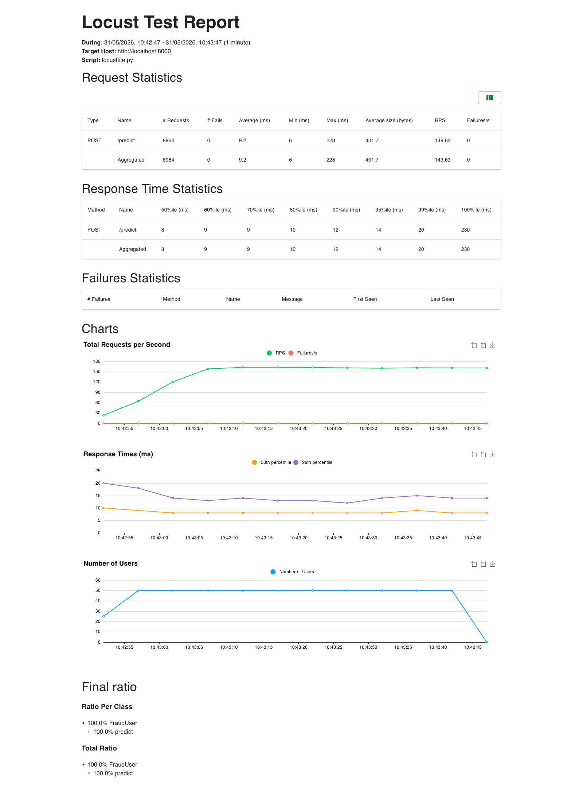
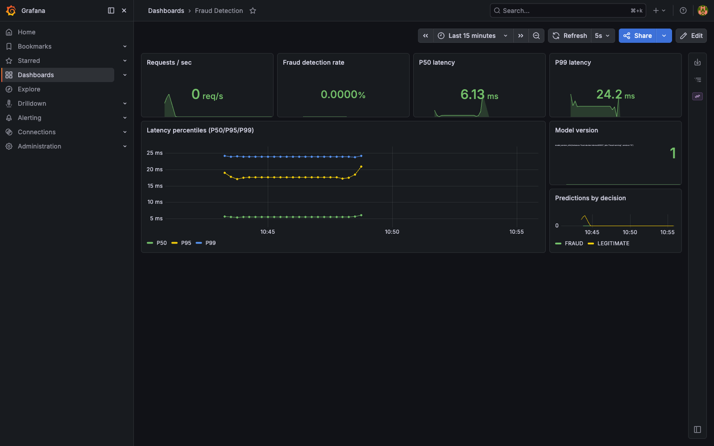
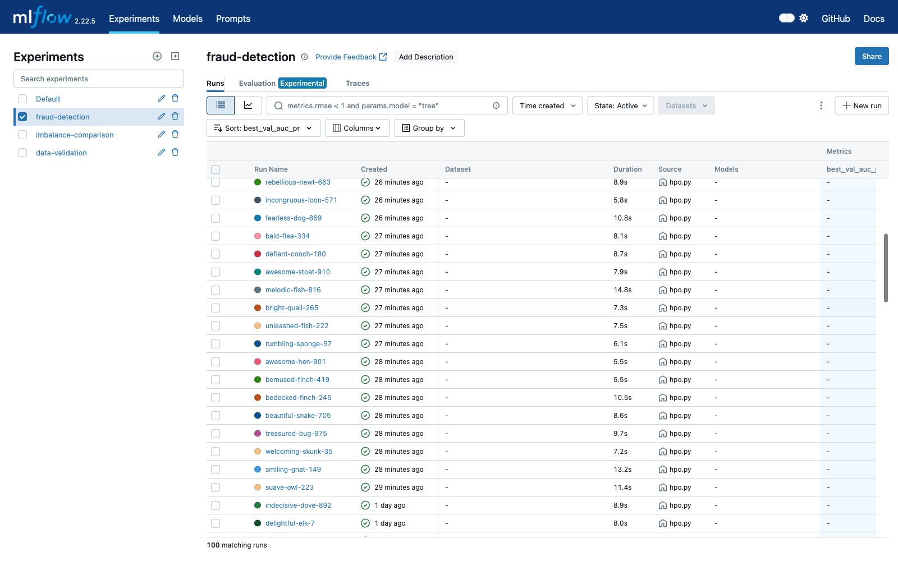
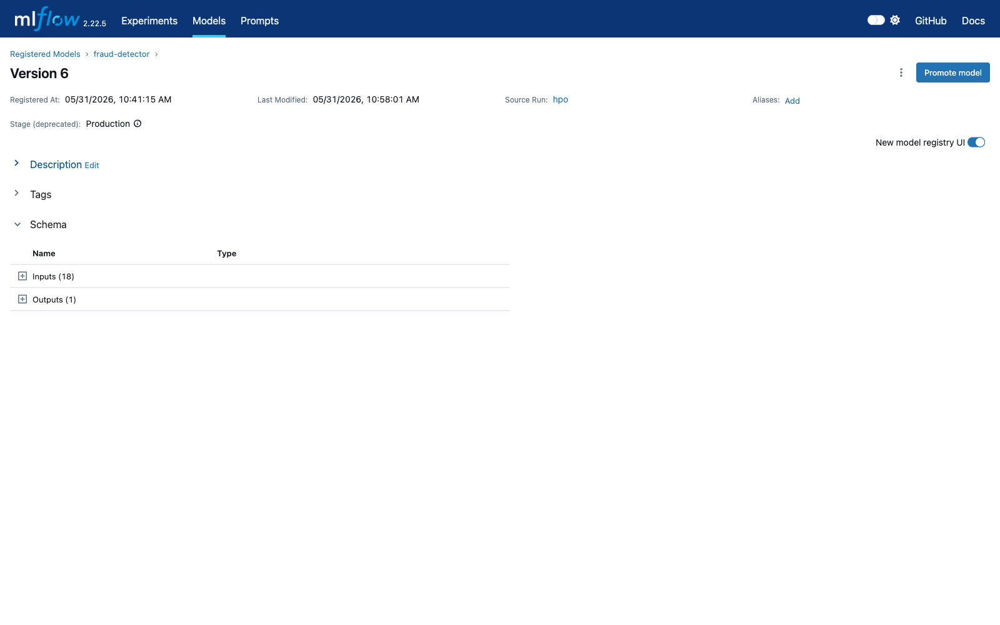
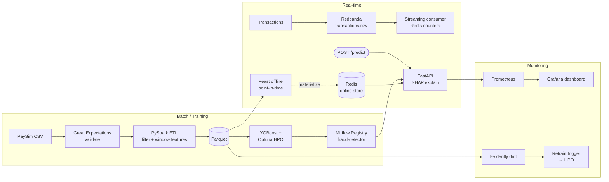

# Real-Time Transaction Fraud Detection

End-to-end ML system that scores financial transactions for fraud probability in real time
(P99 < 25 ms), with **leakage-safe training**, **per-prediction SHAP explanations**,
**drift-triggered retraining**, and a production-shaped streaming + serving path. Built
entirely on free local infrastructure (Docker + minikube-ready manifests) to demonstrate the
engineering, not pay for it.

## Performance

| Metric | Value |
| --- | --- |
| Serving P50 latency | **8 ms** |
| Serving P99 latency | **21 ms** (target: < 100 ms) |
| Sustained throughput | **149 req/s** (50 concurrent users, 0 failures, 8,945 requests) |
| Model AUC-PR | **0.9985** |
| Precision @ 90 % recall | **0.9969** |
| Dataset | PaySim — 6.36M rows → 2.77M engineered features (PySpark) |

> The AUC-PR is high because PaySim's synthetic fraud is near-linearly separable from
> balance-consistency features — this is documented honestly in `DESIGN.md`. The portfolio
> value is the leakage-safe pipeline and the engineering, not the score.

## Screenshots

| | |
| :---: | :---: |
|  |  |
| Load test — 50 users, 60 s, **P99 21 ms** | Grafana — request rate + serving latency |
|  |  |
| MLflow — HPO runs sorted by `val_auc_pr` | MLflow Registry — `fraud-detector` in Production |

> Capture instructions and filenames live in [`docs/screenshots/README.md`](docs/screenshots/README.md).

## Architecture



## Tech stack

| Layer | Tool |
| --- | --- |
| Streaming | Redpanda (Kafka-compatible) |
| Object storage | MinIO (S3-compatible) |
| Online feature store | Redis |
| Feature store | Feast — offline Parquet + online Redis |
| Experiment tracking | MLflow + Weights & Biases (dual) |
| ETL | PySpark (local mode) |
| Training | XGBoost + Optuna (TPE) |
| Explainability | SHAP — interventional in training, tree-path-dependent in serving |
| Serving | FastAPI + Uvicorn |
| Containerization | Docker (multi-stage, non-root) |
| Kubernetes | minikube-ready manifests (deployment / service / HPA / ConfigMap) |
| CI / CD | GitHub Actions — ruff + mypy + pytest + docker build; CD pushes to GHCR |
| Drift | Evidently AI |
| Metrics | Prometheus + Grafana (auto-provisioned) |
| Data validation | Great Expectations |
| Load testing | Locust |
| Code quality | ruff, mypy `--strict`, black, pre-commit (all run from project env) |

## Design decisions

- **AUC-PR over AUC-ROC.** With 0.13 % fraud rate, ROC is dominated by trivial true-negatives
  and looks deceptively perfect. PR focuses on the minority class — the one you actually care
  about catching.
- **Time-based train/test split.** Random splits leak future transactions into training; the
  data is a time series and must be respected as one. The 80 / 20 cutoff is on `step`, not row
  index. Separately discovered: fraud densifies ~4× over time — only visible *because* of
  this split.
- **Entity keyed on `nameDest`, not `nameOrig`.** EDA found 99.85 % of originators appear
  exactly once, so per-customer window aggregates are near-empty. Destinations (mule accounts)
  repeat — mean 2.34, max 113 — so their aggregates carry the real signal.
- **Feast point-in-time joins.** For each training row at time T, Feast returns only features
  computed *before* T. The leakage prevention you'd do by hand becomes a store-enforced
  guarantee, and the same definitions feed serving — eliminating train/serve skew.
- **Tree-path-dependent SHAP for serving.** The interventional explainer (100-row background)
  costs ~100× more per request than tree-path-dependent. Switching dropped P99 latency from
  1,800 ms to 21 ms with no change to the decision — only a minor, still-valid shift in
  attribution method.
- **MLflow pinned to 2.x.** MLflow 3 removed stage-based Model Registry (`Staging → Production`)
  which the serving design uses to load models by stage. Pinning preserves the workflow.
- **`scale_pos_weight` + threshold tuning, not SMOTE.** SMOTE's ranking gain over weighting
  was negligible (~0.002 AUC-PR) on already-separable data — not worth the synthetic-data
  complexity. Threshold tuning is orthogonal (sets the operating point, doesn't change
  ranking) and is the actual lever for production alert workload.

Detailed write-ups (EDA findings, comparison tables, the imbalance study) are in
[`DESIGN.md`](./DESIGN.md). Engineering notes and gotchas are in [`NOTES.md`](./NOTES.md).

## Quick start

```bash
# requirements: Docker Desktop, conda, ~5 GB disk
git clone https://github.com/DhruvParmar051/fraud-ml
cd fraud-ml

# 1. environment + infra
make setup                         # builds conda env, starts docker stack, installs pre-commit
cp .env.example .env               # add your WANDB_API_KEY (optional)

# 2. dataset — download PaySim from Kaggle (free account) and save as:
#    data/raw/paysim.csv
# https://www.kaggle.com/datasets/ealaxi/paysim1

# 3. full pipeline
make train                         # validate → ETL → HPO → register fraud-detector in MLflow
make serve                         # FastAPI on http://localhost:8000  (docs at /docs)
make load-test                     # Locust report at reports/locust_report.html
make integration                   # end-to-end smoke: producer + consumer + serving + load test
```

Open the running stack:

- MLflow UI — http://localhost:5050
- Grafana — http://localhost:3000 (admin / admin) — *Fraud Detection* dashboard auto-loaded
- Prometheus — http://localhost:9090
- MinIO — http://localhost:9001 (minioadmin / minioadmin)
- Redpanda Console — http://localhost:8080

## Makefile commands

| Target | What it does |
| --- | --- |
| `make setup` | Build conda env, start docker-compose, install pre-commit hooks |
| `make train` | Validate → ETL → HPO (`python -m src.training.hpo`) |
| `make serve` | FastAPI server (`uvicorn src.serving.main:app`) |
| `make test` | `pytest tests/ -v --tb=short` |
| `make lint` | `ruff check src/ tests/` + `mypy src/` |
| `make format` | `black` + `ruff check --fix` |
| `make docker-up` / `docker-down` / `docker-logs` | Manage the local stack |
| `make load-test` | Locust @ 50 users, 60s, HTML report |
| `make drift-report` | Generate an Evidently drift report (`reports/drift_*.html` + `.json`) |
| `make retrain-check` | Read latest drift JSON; fire `make train` if drift share > 0.20 |
| `make integration` | End-to-end smoke — full stack + verification |

## Repository layout

```
src/
  data/        validate.py · etl.py (PySpark) · kafka_producer.py · kafka_consumer.py
  features/    build_source.py · offline.py (PIT) · online.py · feature_repo/
  training/    train.py · model.py (FraudModel + SHAP) · evaluate.py · hpo.py · imbalance.py
  serving/     main.py · predict.py · schemas.py · metrics.py · Dockerfile · requirements.txt
  monitoring/  drift.py · retrain_trigger.py
docker/        docker-compose.yml · mlflow/Dockerfile · grafana/ · prometheus/
k8s/           deployment.yaml · service.yaml · hpa.yaml · configmap.yaml
.github/workflows/  ci.yml · cd.yml
notebooks/     01_eda.ipynb
tests/         test_features.py · test_predict.py · test_latency.py
locust/        locustfile.py
scripts/       integration_smoke.sh
DESIGN.md      detailed design decisions + EDA findings + benchmark numbers
```

## What I learned

Most of the difficulty in production ML isn't the model — it's keeping the *system* honest.
**Leakage** is the headline risk (time-based splits, point-in-time feature joins, validation
sets separate from test for HPO). **Version mismatch** is the everyday one: Great Expectations
1.x vs the brief's 0.18; MLflow 3 silently dropping stage registry; Evidently 0.7 rewriting
its API end-to-end; `localhost` inside a container meaning *the container*, not the host. The
habit that paid off most was **pinning versions, mirroring tool config across local /
pre-commit / CI, and writing tests for the boundaries** (request → feature assembly → score).

And — possibly the most undervalued thing on a portfolio — **being honest about results**:
PaySim is too easy, the headline metric is suspiciously high *for a reason*, and what's
worth showing is the engineering and the judgments, not the number.
